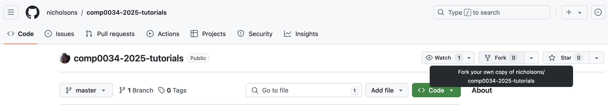
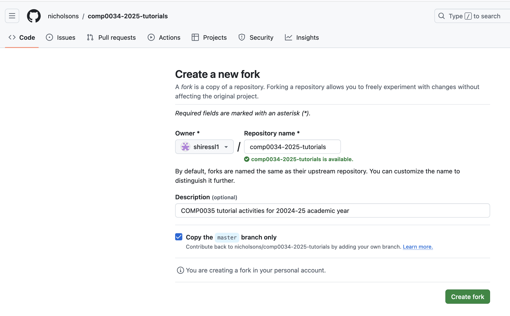

# 1. Setup

## Set up the tutorial project in your IDE

1. Sign in to GitHub. Fork the [tutorials repository](https://github.com/nicholsons/comp0034-tutorials). This
   creates your own repository that has a logical link to the original so that you can later get updates. Updates are
   released weekly.

   **Find the repository and select the Fork button:**

    

   **Create the fork:**

   

2. Clone the repository you just created in your personal GitHub account to your IDE (VS Code, PyCharm)
3. Create and activate a virtual environment
4. Install the required packages that are listed in requirements.txt e.g. `pip install -r requirements.txt`. For this
   tutorial you only need Dash, Dash Bootstrap Components and pandas so you if you prefer you can just install these:
   `pip install dash pandas dash-bootstrap-components`
5. Try `pip install -e .` to set up the code in the project. This should help when importing your own modules.

## Where to find activities and code

The activities folder contains the activity instructions for each week.

The multiple app sub-packages with the `src/student` packages is not typical and is used so that students only need to
have one repository for all the tutorials. You would not usually have several different applications within a package.

The src directory contains the following packages:

- `code-samples`: snippets of code to illustrate concepts
- `student`: use this package to make your changes when you complete the activities
- `tutor`: this package is maintained by the course tutor and will be updated each week

Within these packages there are separate subpackages for each of the applications. `data` is duplicated in student and
tutor, allowing you to make changes to the student version if needed.

The sub-packages are:

- `dash-single`: use this for the Dash single page app activities in weeks 1-5
- `dash-multi`: use this for the optional Dash multi-page app activity in week 1
- `data`: the database and data files that you will need for the apps
- `flask-paralympics`: use this for the Flask activities in weeks 6-10
- `placeholder`: this has code that you will need to move into one of the app folders at a later point in the module

[Next activity](1-2-intro.md)