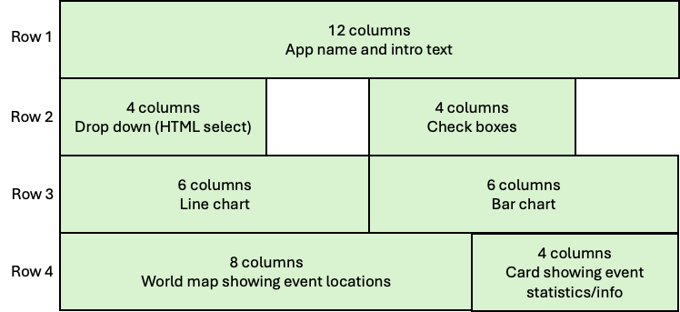
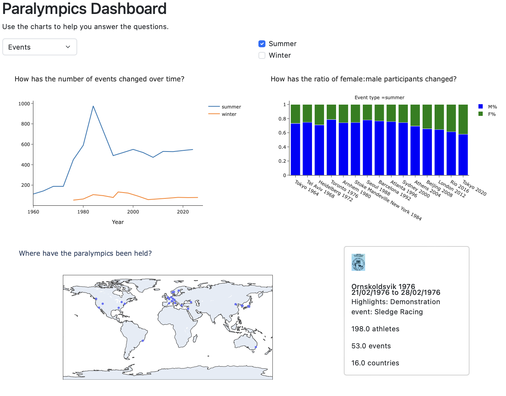

# 2. Introduction to Dash layout and styling

## Introduction to the tutorial

In this week's tutorial you will create a Dash application, focusing on the HTML layout and CSS styling.

The Dash application is based on the paralympics data used in COMP0035 tutorials.

The activities included are:

1. [Create a basic Dash app and add a layout with HTML elements](1-3-dash-app-layout.md)
2. [Enable Dash Bootstrap Components CSS styling for the Dash app](1-4-add-bootstrap.md)
3. [Add the 12 column layout to the Dash app](1-5-12columnlayout.md)
4. [Add HTML components into the layout](1-6-add-html-components.md)
5. [(optional) Create a multi-page version of the app](1-7-multipage-app.md)

The activities build towards a single page Dashboard design with the following layout. The layout is based on a 12
column grid:

Which will ultimately look like this:

You are welcome to change (and improve!) the layout if you don't want to follow the tutorial exactly.

The next section provides guidance aimed at helping you decide on the pages and layout for your coursework app.

## Dash layout choices for the coursework

### Single or multi-page

Dash works by rendering the code as an app with a single page. That is, there is a single page that is updated or
changed depending on the actions the user takes. The app has a single URL. This approach typically provides faster
response times once the page has initially loaded.

The alternative to the single page design approach is to have multiple pages, typically accessed with a menu or
navigation bar. Each page will have its own URL. Dash provides support for multi-page apps
using [Dash Pages](https://dash.plotly.com/urls).

The activities this week focus on a single page design.

For the coursework, you should decide whether your app will be designed as a single or multi-page app. Please note
that designing a multi-page app is a design choice, it does **not** imply you will get a higher mark!

There are plenty of freely available articles that discuss the differences between single and multi-page designs, you
may wish to find and read a few to inform your choice.

### Page layout

Having decided on a single or multi-page layout; next consider the layout or structure of each page.

The lecture introduced the concept of grid based design, with a 12 column grid being a common choice. This is often used
in a responsive way that dynamically adapts to views for different devices.

Boostrap is a well known library that provides responsive CSS styling (and more). Dash bootstrap components is a library
that implements this for Dash apps.

[Dash Bootstrap components](https://dash-bootstrap-components.opensource.faculty.ai/docs/components/layout/) supports
the grid style design, with CSS styles to apply to rows and columns.

Dash bootstrap components is recommended for the coursework.

### Inspiration from other apps

Have a look at the examples of apps built with Dash. These may give you inspiration for the layout of your own app.

- [Examples from the Plotly Dash website](https://plotly.com/examples/dashboards/).
  Look at these may give you ideas for your own layout.
- [Repository with multi-page app examples](https://github.com/AnnMarieW/dash-multi-page-app-demos).

You may also find references for designing dashboard layouts useful. These are mostly commercial sources, not academic,
all give either examples or guidance on design.

- [Datacamp: Dashboard Design Checklist](https://www.datacamp.com/blog/infographic-dashboard-design-checklist?utm_source=google&utm_medium=paid_search&utm_campaignid=19589720821&utm_adgroupid=152984011174&utm_device=c&utm_keyword=&utm_matchtype=&utm_network=g&utm_adpostion=&utm_creative=719914245823&utm_targetid=dsa-2222697810718&utm_loc_interest_ms=&utm_loc_physical_ms=1006997&utm_content=DSA~blog~Data-Literacy&utm_campaign=230119_1-sea~dsa~tofu_2-b2c_3-row-p1_4-prc_5-na_6-na_7-le_8-pdsh-go_9-nb-e_10-na_11-na-fawnov24&gad_source=1&gbraid=0AAAAADQ9WsEUf8WvJuE98PZavHqYyYnCA&gclid=Cj0KCQiAire5BhCNARIsAM53K1h5oZxeCXHF8a1nM5IaIoSiu1uxCA68xk10Ed03IeykV_jz-X75hxcaAjxJEALw_wcB) -
  a structured approach to designing a dashboard
- [Tableau Blog: Stephen Few's 8 Core Principles for data visualisation design](https://www.tableau.com/blog/stephen-few-data-visualization)
- [Toptal: Top Data Vis examples and Dashboard designs](https://www.toptal.com/designers/dashboard-design/top-data-visualization-dashboard-examples)
- [Halo lab: Modern dashboard design - best practices and examples](https://www.halo-lab.com/blog/dashboard-design-examples)

[Next activity](1-3-dash-app-layout.md)