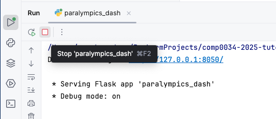
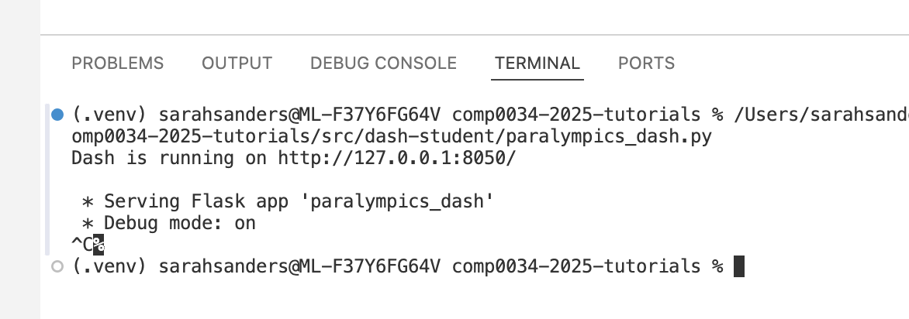

# 3. Create a Dash app and add HTML to the layout

## Code to create a basic Dash app

There is code to run a basic Dash app in `src/student/dash_single/paralympics_dash.py` that displays 'Hello world'. This
is copied from the [Dash tutorial](https://dash.plotly.com/tutorial).

You can name the python file anything **except** `dash.py`. If you name it `dash.py` it will conflict with the Dash
library and your app won't run.

1. Run `src/student/dash_single/paralympics_dash.py`

   You may need to change the port number if you already have something running on the default port 8050
   e.g. 
   ```python
    # Run the app
    if __name__ == '__main__':
        app.run(debug=True, port=5050)
   ```

2. Go to the URL that is shown in the terminal. By default, this is <http://127.0.0.1:8050>.
3. Stop the app using `CTRL+C` in the Terminal.

    Pycharm screenshot - you can use the red square to stop the app

    

    VS Code screenshot - use `CTRL+C` in the Terminal to stop the app

    

Dash includes "hot-reloading". This feature is activated by default when you run your app with `app.run(debug=True)`.
This means that Dash will automatically refresh your browser when you make a change in your code. You don't need to keep
stopping and restarting the app for the changes to be reflected.

## Create a Dash page with HTML elements

### HTML basics

The basic tag structure for HTML is `<start_tag> some content </end_tag>`. This set of opening tag + content + closing
tag is referred to as an **HTML element**.

A small number of elements only have an opening tag e.g. ``, `<br>`, `<hr>`. There is a list of
these [void elements here](https://developer.mozilla.org/en-US/docs/Glossary/Void_element).

Elements can also have attributes that give additional information. In this course you will mostly use id
e.g. `id="some-name"` and class e.g. `class="some-class"`. `id` is used to locate a particular element on a webpage,
and `class` is used in adding styles to elements (more on these in later sections).

HTML documents start with a document type declaration `<!DOCTYPE html>`. This is required at the start of the document.

The HTML document itself begins with `<html>` and ends with `</html>`

The part that is mostly not visible in the final webpage is between `<head>` and `</head>`. This is typically metadata,
i.e. info about the page.

The part of the HTML document that is visible in the browser is between `<body>` and `</body>`.

A minimal page structure looks like the following:

```html
<!DOCTYPE html>
<!-- This is an HTML comment, you won't see it on the page -->
<!-- Head section -->
<html lang="en">
<head>
    <meta charset="utf-8">
    <title>COMP0034 Introduction to HTML - Basic page structure</title>
</head>
<!-- Body section -->
<body>
<p>Here is some text on a page.</p>
</body>
</html>
```

### Using HTML in Dash

Dash provides an API, [Dash HTML Components](https://dash.plotly.com/dash-html-components), that "provides pure Python
abstraction around HTML, CSS, and JavaScript. Instead of writing HTML or using an HTML templating engine, you compose
your layout using Python with the Dash HTML Components module (dash.html)"

The HTML tags supported by Dash are [listed here](https://dash.plotly.com/dash-html-components#full-elements-reference).
You may need to refer to an [HTML reference](https://www.w3schools.com/html/) to know what the tags and their attributes
are. You will not write pure HTML files. You will only use Dash html python functions.

This is an example given in the Dash documentation:

```python
from dash import html

html.Div([
    html.H1('Hello Dash'),
    html.Div([
        html.P('Dash converts Python classes into HTML'),
        html.P("This conversion happens behind the scenes by Dash's JavaScript front-end")
    ])
])
```

which equates to the following HTML:

```html

<div>
    <h1>Hello Dash</h1>
    <div>
        <p>Dash converts Python classes into HTML</p>
        <p>This conversion happens behind the scenes by Dash's JavaScript front-end</p>
    </div>
</div>
```

HTML elements can have properties such as style (CSS), class (CSS classes which you will see later) and id (to uniquely
identify an element on a page). More on this in a later activity.

### Add HTML elements to the Dash layout

The [Dash layout documentation is here](https://dash.plotly.com/layout).

The dash app starter code in `paralympics_dash.py` currently looks like this:

```python
# Imports for Dash and Dash.html
from dash import Dash, html

# Create an instance of the Dash app
app = Dash(__name__)

# Add an HTML layout to the Dash app
app.layout = html.Div([
    html.Div(children='Hello World')
])

# Run the app
if __name__ == '__main__':
    app.run(debug=True)
```

The HTML to create the page layout is added to the `app.layout =` section of the code.

A 'Div' is an HTML element that stands for "division" and is primarily used as a container to create sections or
divisions in a web page. This is useful as you can target the Div to apply styles, or to locate sections on the page.

In Dash, you add an HTML element (referred to as component in the Dash documentation) using the Dash html python
function for the HTML tag. Each of the components has keyword attributes. By default, the first attribute is a property
called "children". This is special and so long as you specify the children first, you do not have to include the
"children=" keyword.

```python
# children is a special attribute and if used as the first attribute does not need to be named
html.H1(children='Hello Dash') 
# is the same as 
html.H1('Hello Dash')

# Children in the example above was the text. Children can also be nested components in a list '[]'. For example:
html.Div(children=[
    html.H1('A first heading'),
    html.P('A bit more text after the heading')
])
```

Add some HTML elements to the page:

- A div (html.Div) that contains:

    - A level 1 heading (html.H1) with an id of 'example-div'
    - A paragraph (html.P)
    - An image (html.Img)

The documentation explaining each HTML tag (component) is in
the [Dash html components reference](https://dash.plotly.com/dash-html-components).

Images are in the [assets](../../src/student/dash_single/assets) folder. To reference these in the `src=` parameter use the
`app.get_asset_url()` function. In the brackets specify the file name and any subdirectory below the 'assets' directory,
e.g. `html.Img(src=app.get_asset_url('bar-chart-placeholder.png'))`

Add any other elements you want to try.

Run the app again if you previously stopped it.

[Next activity](1-4-add-bootstrap.md)