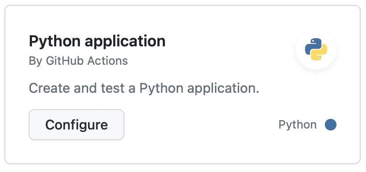

# Testing from the web browser

## Introduction

In COMP0035 you learned:

- unit tests of functions with pytest, including creating fixtures and the use of `conftest.py`
- running the tests on a continuous integration platform, e.g., GitHub Actions
- reporting on coverage, that is the extent to which the tests cover the application's source code

The focus of this tutorial is to test typical sequences of actions a user would carry out when using the app in a
browser. This type of testing is sometimes called integration testing, system testing or browser testing. The Plotly
Dash documentation refers to them as 'end-to-end testing'.

You will do this from a Chrome browser using Pytest, Selenium Webdriver and a ChromeDriver.

[Selenium webdriver](https://www.selenium.dev/documentation/webdriver/) allows you to run tests automatically in the
browser, that is you simulate the behaviour of a user
carrying out specific actions in the browser and then use assertions to verify conditions or state.

Selenium can be used with several test libraries. pytest is recommended in the Dash and Flask documentation.

ChromeDriver is a utility that runs on your computer and allows the code to run and access the Chrome browser
application on your computer. The version you need to use has to match your operating system and the version of the
Chrome browser you are using.

Dash also supports unit testing of callbacks which will be covered in this tutorial.

## Set up the testing environment

To set up testing in your Python environment you need to:

- install your own code e.g. `pip install -e .` which relies on your `pyproject.toml`
- install the `pytest` and `selenium` Python packages
- install the `dash[testing]` utilities. This may be either: `pip install dash[testing]`, or in some Terminal shells (
  for example, Zsh), you may need to escape the opening bracket, [: `pip install dash\[testing]`
- install a chrome driver that matches your browser
- optionally, set up a GitHub Actions workflow to run the tests

The following sections explain each of these.

### Install selenium and pytest

Install selenium and pytest in your Python project's vitual environment, e.g.: `pip install selenium pytest`

### Install chromedriver

Warning: This is somewhat painful as every time Chrome is updated, you also need to update the chromedriver.

Selenium requires a driver that handles the browser interactions. Drivers are available for Chrome, Firefox etc. For the
coursework please use Chrome to facilitate marking. Dash testing only supports Chrome and Firefox.

1. Find the version of Chrome you're using (in the Settings | About Chrome in the Chrome app)
2. Go to [this page](https://googlechromelabs.github.io/chrome-for-testing/)
3. Find the relevant **chromedriver** (take care not to choose just **chrome** by mistake), copy the URL.
4. Use the URL to retrieve a small file containing the version of ChromeDriver to use.
5. Extract the zipped folder to get the chromedriver.exe executable file
6. Place this `chromedriver.exe` file in the `Path` of your operating system if you know how to do this. If you don't
   know how to, place it in the project folder with the test code.

You may need to refer to the following:

- [Chromedriver documentation on referencing the driver location](https://developer.chrome.com/docs/chromedriver/get-started)
- [Chromedriver documentation on version selection](https://chromedriver.chromium.org/downloads/version-selection)
  explains options for
  installation.

Note for mac users: I downloaded the zip, then open in Finder and right-click on the .exe and open in Terminal. This
will ask you if you are sure. Once you've opened and run it, stop it running. The permissions to open the file will now
be set. You can now move the file, e.g. to usr/local/bin is a common location for MacOS.

## Set up GitHub Actions

Setting up a workflow was covered in COMP0035 and is not repeated. You can refer to
the [GitHub documentation](https://docs.github.com/en/actions/automating-builds-and-tests/building-and-testing-python).

Go to Actions tab in GitHub Actions and you will see starter workflows. The Python Application starter workflow is close
to what you need so is a good starting point.

The GitHub actions environment includes chromedriver and Chrome so you don’t need to explicitly install them.

You may want to modify the GitHub Actions workflow `.yml` file in the following areas:

1. Modify the server operating system to match your computer if you are running Windows e.g. you can change
   `ubuntu-latest` to `windows-latest`
2. Modify the version of Python to match what you are using in the `name: Set up Python` section.
3. Include a step with `pip install –e .` in the `name: Install dependencies` section.
4. Include a step to install `selenium`, `pytest` and any other test libraries you are using in
   the `name: Install dependencies` section.
5. Add a step to install `python -m pip install dash\[testing]`

## Introduction to using Selenium Webdriver for testing

The general approach is:

- decide what you are going to test in the test case
- create and run the Dash app for testing
- create an instance of a driver
- use the driver to navigate to a URL in your Dash app
- carry out a sequence of interactions on the browser that mimic what a user would do
- find a value on the page that you can use in an assertion to confirm that the test passed

The following activities cover these steps.

[Next activity](4-1-test-app-url.md)
