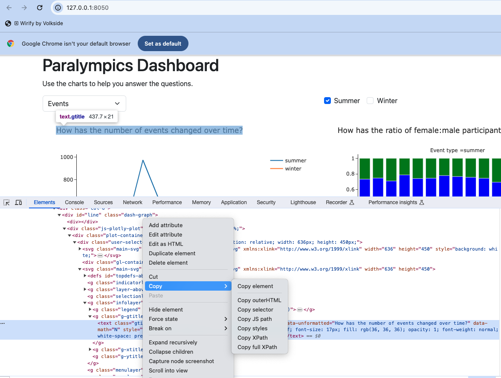

# Locating elements where you do not know the id, class or tag

This next example uses the driver to make a selection from a dropdown menu before trying to find a value to assert.

The element that changes is the chart. The chart is HTML generated by Plotly, and do you do not have control over the
use of tags, classes, ids etc. within the chart.

For example, to find the title displayed in the bar chart.

Run the Dash app, open it in Chrome, right-click on the chart and then Inspect, the
developer console should open with the Element window at the code for the element you clicked on. Expand the elements in
the `<div id='map'>` then `<div class=plot-container plotly>` section until you find the element with `class="main-svg"`
and then the one with `class=infolayer` then `class=g-gtitle`. Once you find the title, if you right-click there are
options to 'copy selector' and 'copy full Xpath'.



If you copy the selector, you can then paste to this to your code to define the element:

```python
css_selector = '#line > div.js-plotly-plot > div > div > svg:nth-child(3) > g.infolayer > g.g-gtitle > text'
chart_title = dash_duo.find_element(css_selector)
```

If you copy the Xpath it looks more like this which you can then use with the selenium driver `find_element(By.XPATH)`:

```python
from selenium.webdriver.common.by import By

fullxpath = '/html/body/div/div/div/div[3]/div[1]/div/div/div[3]/div[1]/div/div[2]/div/div/svg[2]/g[4]/g[2]/text'
chart_title = dash_duo.driver.find_element(By.XPATH, xpath)
```
Try adding and running a test similar to the following

```python
def test_line_chart_selection(dash_duo):
    """
    GIVEN the app is running
    WHEN the dropdown for the line chart is changed to
    THEN the H1 heading text should be "Paralympics Dashboard"
    """
    app = import_app(app_file="paralympics_dash.paralympics_app")
    dash_duo.start_server(app)
    # To find an element by id you use '#id-name'; to find an element by class use '.class-name'
    dash_duo.wait_for_element("#type-dropdown", timeout=2)

    # See https://github.com/plotly/dash/blob/dev/components/dash-core-components/tests/integration/dropdown/test_dynamic_options.py#L31
    # Not easy to follow but give syntax for selecting values in a dropdown list
    dropdown_input = dash_duo.find_element("#type-dropdown")
    dropdown_input.send_keys("Sports")
    dash_duo.driver.implicitly_wait(2)

    # Run the app and use Chrome browser, find the element, right click and choose Select, find the element in the 
    # Elements console and select 'copy selector'. Pate this as the value of the variable e.g. see css_selector below.
    css_selector = '#line > div.js-plotly-plot > div > div > svg:nth-child(3) > g.infolayer > g.g-gtitle > text'
    chart_title = dash_duo.find_element(css_selector)
    assert ("sports" in chart_title.text), "'sports' should appear in the chart title"

```

## Write a test that uses the chrome driver to carry out a series of user actions

For this test:

- Find the <div id=card></div> which should initially have no children or no elements below it. You could do this using
  syntax like `parent.findElements(By.xpath("./child::*"))` which should be empty. The code below counts the number of
  cards on the page which should be 0.
- Find the chart with the 'id=map'
- Find a map marker and hover which should display a card. This will require the Chrome Inspector again to get the
  selector for a point.
- Find the <div id=card></div> again, could the number of cards in it which should now be 1.

[Selenium interaction functions](https://www.selenium.dev/documentation/webdriver/elements/interactions/) include
click(), send_keys(), submit() and clear(). To cover is more complex and requires the use of
the [Actions API](https://www.selenium.dev/documentation/webdriver/actions_api/).

```python
from selenium.webdriver import ActionChains


def test_map_marker_hover_updates_card(dash_duo):
    """
    GIVEN the app is running which has a <div id='map>
    THEN there should not be any elements with a class of 'card' one the page
    WHEN a marker in the map is selected
    THEN there should be one more card on the page then there was at the start
    AND there should be a text value for the h6 heading in the card
    """
    # Start the app in a server
    app = import_app(app_file)
    dash_duo.start_server(app)

    # Wait for the div with id of card to be on the page
    dash_duo.wait_for_element("#card", timeout=2)

    # There is no card so finding elements with a bootstrap class of 'card' should have a length of 0
    cards = dash_duo.find_elements(".card")
    cards_count_start = len(cards)

    # Find the first map marker
    marker_selector = '#map > div.js-plotly-plot > div > div > svg:nth-child(1) > g.geolayer > g > g.layer.frontplot > g > g > path:nth-child(1)'
    marker = dash_duo.driver.find_element(By.CSS_SELECTOR, marker_selector)

    # Use the Actions API and build a chain to move to the marker and hover
    ActionChains(dash_duo.driver).move_to_element(marker).pause(3).perform()

    # Wait for the element with class of 'card'
    dash_duo.wait_for_element(".card", timeout=1)

    # Count the cards again
    cards = dash_duo.find_elements(".card")
    cards_count_end = len(cards)

    # Find the card title and get the textContent attribute value
    card_title = dash_duo.find_element("#card-title")
    text = card_title.get_attribute("textContent")
    
    # The card title should have a text value (e.g. Rome 1960) and there should be 1 card (was 0 at the start)
    assert text != ""
    assert cards_count_end - cards_count_start == 1
```

Run the test.
