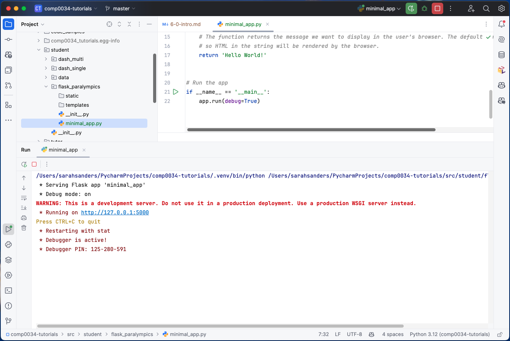
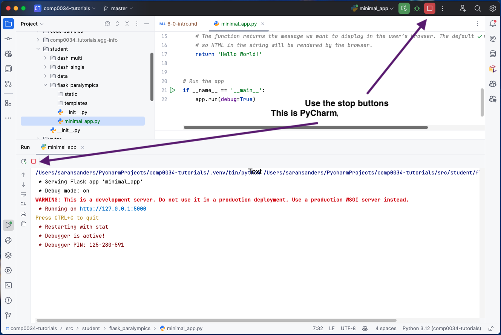

# Introduction to Flask applications

You are advised to start these before the tutorial so that you have time to learn the basics and consider any
questions you may have.

This first activity will guide you through the basic structure of a Flask app.

## Open and run a minimal Flask app

1. Open [minimal_app.py](../../src/student/flask_paralympics/minimal_app.py) and read the comments that explain what
   each line does.

2. Run the Flask app using the run function in the IDE (usually a green triangle in PyCharm and VS Code). You should see
   output in the terminal similar to the following:

   

3. Click on the URL which is likely to be the default <http://127.0.0.1:5000>. You should see your app in a browser.

   The app has been run on a development server and hosted on your machine at that URL. You are accessing your app
   locally. It is not accessible by anyone else.

   If another program is already using port 5000, you’ll see an OSError when the server tries to start. It may have one
   of the following messages:

   ```
   OSError: [Errno 98] Address already in use
   OSError: [WinError 10013] An attempt was made to access a socket in a way forbidden by its access permissions
   ```

   To address this, specify a different port number in the code that runs the app, e.g.:

   ```python
   if __name__ == '__main__':
       app.run(port=5001)
   ```

## Run the app from the command line in Terminal

Another way to run the Flask app is to run it from the Terminal command line. This is the way that is recommended in the
Flask documentation and will be used in all future activities.

Use the `--app` option to point to your application, and the `--debug` option to enable debug mode.
Use `flask run --help` to see the available options.

```
flask --app src/student/flask_paralympics/minimal_app.py run --debug
```

Add `--port 5001` (or any other port number that is not in use) to the end of the command chain if you need to change
the port number.

Try entering the above command in Terminal.

What happened?

You already have a running Flask app from the earlier activity. You will need to stop that app from running before you
try to start another on the same port.

## Stop a running Flask app

If you ran the app in PyCharm you may have a button (red outlined square) in the interface that allows you to stop the
app. If so, press this.



Otherwise, you will need to stop it from the command line interface (CLI) by pressing the `ctrl` and `c` keys at
the same time. If you look at the CLI in the image above you can see that you are told to do this.

Stop the running app using `CTRL+C`.

## View and run a Flask app that uses a template

In the [flask_paralympics](../../src/student/flask_paralympics) directory there are two subdirectories:

- `static` contains CSS and JavaScript files. The files in the folders are downloaded
  from [Bootstrap](https://getbootstrap.com). This will be used in activity 6.3.
- `templates` contains an HTML file. 

Run the app from the Terminal command line in your IDE. This time append "/hello" to the URL e.g.
`http://127.0.0.1:5000/hello`. 

`flask --app src/student/flask_paralympics/minimal_app.py run --debug`

Don't forget to stop the running app using `CTRL+C` in the command line interface.

## Task: Create a Flask app file for the paralympics app

Create a python file for the paralympics app, e.g. `paralympics_app.py`.

You can give the python file any name except for flask.py as calling it `flask.py` would conflict with the Flask package
itself.

Add code to create an instance of a Flask app and add a home page for the route "/".

Make sure you can run and stop the paralympics app.

You should now have 2 routes that return different pages:
    - http://127.0.0.1:5000
    - http://127.0.0.1:5000/hello

[Next activity](6-2-structure.md)