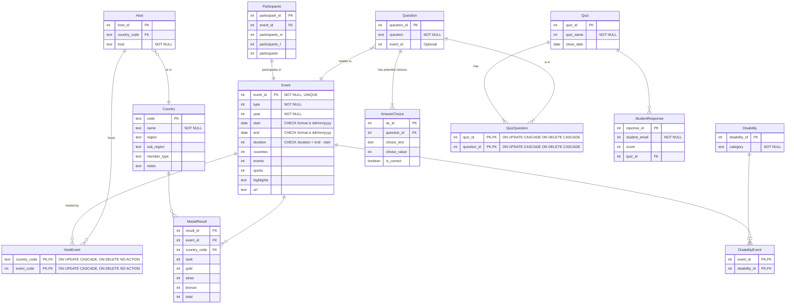

# Defining models

While there is some documentation
in [Flask-SQLAlchemy on defining models](https://flask-sqlalchemy.readthedocs.io/en/stable/quickstart/#define-models),
most of what you will need in this activity will be in the
[SQLAlchemy documentation](https://docs.sqlalchemy.org/en/20/orm/quickstart.html#declare-models).

## Overview of SQLAlchemy model classes

You will define Python classes that are needed in your app.

For any class that also relates to a table in the database, there is a specific syntax that you should to use.

Classes that are used in the app but not stored in the database will follow normal Python class syntax.

SQLAlchemy refers to these classes as "models". You will see this terminology used in the documentation. For this
reason, the Python module that contains the classes is also often named `models.py` - this is a convention but is not
mandatory.

There are two styles of mapping Python classes to database in SQLAlchemy: Declarative and Imperative. The documentation
states that the more modern approach is to use Declarative mapping so this is what is used in the teaching materials.

When you define a Python class that maps to a database table, consider the following:

1. Define the Python class with an appropriate name using CamelCase.
2. Inherit the `Base` SQAlchemy class that you defined in the app's `__init__.py` in activity 7-1. You access this using
   the Model property of the `db` object that you created, so `db.Model` is how you refer to the Base class.
3. Define the database table that the Python class is mapped to:

    - The database table name will be created automatically which will be converted from CamelCase to snake_case e.g. a
      class named "SomeObject" would lead to a database table called "some_object" being created.
    - If you want to indicate that a Python class matches an existing table that is not the same as the class name, then
      you
      can define this using `__tablename__ = "Your table name"`
4. The class attributes map to column names in the database. You specify how these are mapped - at this point you can
   highlight any differences between the attribute and column names and data types.
5. The Base model class that you inherited automatically gives the class access to functions that will handle the
   constructor so you don't need to define it.

Attributes are mapped to columns [using
`mapped_column()`](https://docs.sqlalchemy.org/en/20/orm/declarative_tables.html#declarative-table-with-mapped-column).

Different levels of detail are shown for each attribute/column mapping depending on the needs, for example:

1. An attribute that has the same data type in the Python class and the database table: e.g., `fullname = mapped_column(String)`
2. An attribute that also has a database constraint: e.g., `name = mapped_column(String(50), nullable=False)`
3. An attribute that has a different data type in the class and table:  e.g., `start: Mapped[Optional[str]] = mapped_column(Text)`. NB: If you use Mapped[] then a column is treated as "NOT NULL", you have to add the Optional to make it not null.
4. An attribute that has a different name in the class than in the table:

The [syntax for the database constraints](https://docs.sqlalchemy.org/en/20/core/constraints.html) differs from SQL:

- PRIMARY KEY `primary_key=True`
- NOT NULL `nullable=False`
- UNIQUE `unique=True`
- CHECK `CheckConstraint("col1>5")` where `col1>5` is the constraint in this example
- FOREIGN KEY `ForeignKey("parent.id", onupdate="CASCADE", ondelete="CASCADE")` where `parent.id` references the table
  and id of the column of the linked

Relationships using FK/PK between classes are explained in the next activity 7-4.

Defining the classes does not create them in the tables. This requires an extra step which is covered in activity 7-5.

## Define the models (classes)

Create a python file called `models.py`. This will contain classes that map to your database tables.

The syntax for a class that maps to a database table is given in
the [Flask-SQLAlchemy documentation](https://flask.palletsprojects.com/en/2.3.x/patterns/sqlalchemy/#flask-sqlalchemy-extension)
.

For the full documentation refer
to [SQLAlchemy model documentation](https://docs.sqlalchemy.org/en/20/orm/mapper_config.html).

Add a class for each of the tables in the paralympics database in `models.py`. The code is given for some of the tables
to
save time in the tutorial, you need to complete the missing tables at the end of the file.

### ERD



## Reflection

Refection is a technique that uses the metadata for an existing database and auto creates Python classes from that.

The column names and data types will be the same in Python as in the database table. This is quicker but less flexible if
you later need to change the tables. Your IDE also will not be able to identify potential issues with your code as it
won't know the tables and attributes.

To use this approach, refer to
the [Flask-SQLAlchemy documentation](https://flask-sqlalchemy.readthedocs.io/en/stable/models/#reflecting-tables) as
this is more succinct than using SQLAlchemy directly.

First, you need to add the following code to the `create_app()` function after the object has been initialised for
Flask:

```python
db.init_app(app)

with app.app_context():
    db.reflect()
```

Then in models.py you can define the models like this:

```python
class Event(db.Model):
    __table__ = db.metadata.tables["event"]
```

[Next activity](7-4-relationships.md)