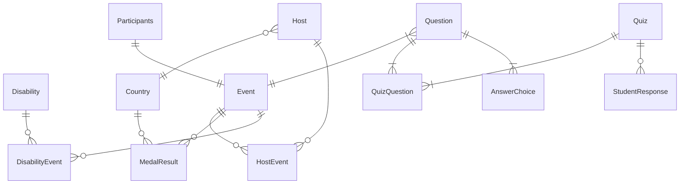
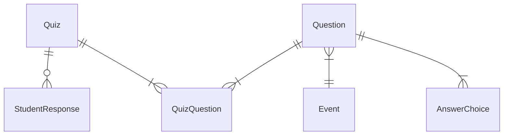

# Establishing relationships in SQLAlchemy

## SQLAlchemy bidirectional one-to-many relationship

In principle defining bidirectional relationships in SQLAlchemy makes the later queries easier as you can navigate
relationships from either the parent or the child. That is the parent can find its children, and a child can find its
parent.

The following activity creates one-to-many bidirectional relationships. Relationships do not have to be bidirectional.
SQLAlchemy also supports one-to-one, many-to-many and many-to-one definitions.
Please refer to the [SQLAlchemy relationships documentation](https://docs.sqlalchemy.org/en/20/orm/relationships.html)
for other options.

The official documentation states "To establish a bidirectional relationship in one-to-many, where the “reverse” side is
a many to one, specify an additional `relationship()` and connect the two using the `relationship.back_populates`
parameter, using the attribute name of each `relationship()` as the value for `relationship.back_populates` on the
other:"

```python
class Parent(db.Model):
    __tablename__ = "parent_table"

    id: Mapped[int] = mapped_column(primary_key=True)
    children: Mapped[List["Child"]] = relationship(back_populates="parent")


class Child(db.Model):
    __tablename__ = "child_table"

    id: Mapped[int] = mapped_column(primary_key=True)
    parent_id: Mapped[int] = mapped_column(ForeignKey("parent_table.id"))
    parent: Mapped["Parent"] = relationship(back_populates="children")
```

## Add bidirectional relationships to the paralympics classes

You already have the foreign and primary keys defined which is sufficient for the database.

Adding the bidirectional relationships gives additional flexibility when constructing queries using the Python classes.

The relationships in the ERD show what needs to be created. Participant to Event is one-to-one, all others are
one-to-many:



During normalisation, tables were introduced to address many-to-many relationship. SQLAlchemy supports a different
syntax that defines the table in the middle as
an [association table](https://docs.sqlalchemy.org/en/20/orm/basic_relationships.html#many-to-many). As we already have
the tables, this is not used in the tutorial example, though you may want to consider it for your coursework.

In a one-to-many relationship a parent can have a list of child objects that are associated with it. The SQLAlchemy
documentation uses the
import `from typing import List` for lists.

You also need to import `from sqlalchemy.orm import relationship`

Here is how the relationship could be defined between Event - DisabilityEvent - Disability:

```python
from typing import List

from sqlalchemy import ForeignKey, Integer, String, Text
from sqlalchemy.orm import Mapped, mapped_column, relationship

from student.flask_paraparalympics import db


class Event(db.Model):
    event_id: Mapped[int] = mapped_column(primary_key=True)
    type: Mapped[int] = mapped_column(required=True)
    year: Mapped[int] = mapped_column(required=True)
    date_start: Mapped[str] = mapped_column(Text)
    date_start_text: Mapped[str] = mapped_column(Text)
    duration: Mapped[int]
    countries: Mapped[int]
    events: Mapped[int]
    sports: Mapped[int]
    highlights: Mapped[String] = mapped_column(Text)
    url: Mapped[String] = mapped_column(Text)

    # Relationship to the DisabilityEvent table. back_populates takes the name of the relationship that is defined in the DisabilityClass
    disability_events = Mapped[List["DisabilityEvent"]] = relationship(back_populates="event")


class Disability(db.Model):
    __tablename__ = 'disability'

    disability_id: Mapped[int] = mapped_column(Integer, primary_key=True)
    category: Mapped[str] = mapped_column(Text, nullable=False)

    # Relationship to the DisabilityEvent table. back_populates takes the name of the relationship that is defined in the DisabilityClass
    disability_events = Mapped[List["DisabilityEvent"]] = relationship(back_populates="disability")


class DisabilityEvent(db.Model):
    __tablename__ = 'disability_event'

    event_id: Mapped[int] = mapped_column(ForeignKey('event.event_id'), primary_key=True)
    disability_id: Mapped[int] = mapped_column(ForeignKey('disability.disability_id'), primary_key=True)

    # Relationships to the parent tables, Disability and Event
    # back_populates takes the name of the relationships that is defined in the parent classes (same name was used in both)
    event = Mapped["Event"] = relationship("Event", back_populates="disability_events")
    disability = Mapped["Disability"] = relationship("Disability", back_populates="disability_events")
```

## Add the relationships to tables related to the quiz features

In `models.py` add the relationships for the following classes:

- class Quiz(db.Model):
- class Question(db.Model):
- class AnswerChoice(db.Model):
- class QuizQuestion(db.Model):
- class StudentResponse(db.Model):

Where the relationships are:



[Next activity](7-5-create-database.md)