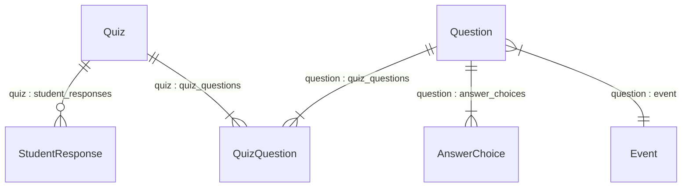

from student.placeholder.models import StudentResponsefrom pandas.tseries.holiday import after_nearest_workday

# Database queries with SQLAlchemy

## Queries return Python objects

When using sqlite3 with SQL you worked with tuples to pass/receive values. It is possible to use raw SQL with
SQLAlchemy though this is not covered in the teaching materials.

When using SQLAlchemy, you work with Python objects.

For this activity refer to:

- [Flask-SQLAlchemy modifying and querying data](https://flask-sqlalchemy.readthedocs.io/en/stable/queries/) - this
  gives you the syntax specific to Flask-SQLAlchemy
- [SQLAlchemy ORM querying guide](https://docs.sqlalchemy.org/en/20/orm/queryguide/index.html) - this gives the general
  SQLAlchemy syntax, not specific either to SQLite or to Flask

## Queries in Flask

In a Flask app, you work in contexts. Flask has two types of contexts:

- request context (the code for a route is usually in a request context)
- application context (usually when working at the application level such as configuring the app, connecting to the
  database). You have already seen this in the `create_app` function, e.g.

```python
with app.app_context():
    db.create_all()
```

For more on contexts, read Patrick Kennedy's
article [Understanding the Application and Request Contexts in Flask](https://testdriven.io/blog/flask-contexts/)

For this activity, you will create routes with functions that run the queries so you do not need to explicitly create a
context as the route creates a request context.

## SQLAlchemy syntax

The sqlite3 code to select one event details might look like this:

```python
result = cursor.execute("SELECT * from Event;")
```

You can use SQLAlchemy with SQL, though this is not covered in this tutorial. You can use your SQL knowledge
to construct the query and then the SQLAlchemy session object to execute and commit. For example:

```python
result = db.session.execute("SELECT * FROM Event")
print(result.fetchall())
```

In SQLAlchemy you can query using the ORM, which uses objects and their attributes.

Insert and delete questions use: `db.session.add()` or `db.session.delete()` followed by `db.session.commit()`

To update you make a change to the object and the commit the change using `db.session.commit()`

For select queries use `db.select()` to define a query and `db.session.execute()` to execute it.

## SELECT queries

Construct the query using [
`db.select()`](https://docs.sqlalchemy.org/en/20/core/selectable.html#sqlalchemy.sql.expression.select).

Execute the query using `db.session.execute()`.

Executing a select returns a Result object that has methods for working with the returned rows.

So the SQLAlchemy version would look like this:

```python
select_query = db.select(Event).filter_by(event_id=1)
result = db.session.execute(select_query)
event = result.scalar_one()

# This is the same in a single line
event = db.session.execute(db.select(Event).filter_by(event_id=1)).scalar_one()
```

See ["writing SELECT" statements for ORM Mapped classes](https://docs.sqlalchemy.org/en/20/orm/queryguide/select.html#writing-select-statements-for-orm-mapped-classes).

### Access the query result as Python objects

Result object methods include:
`all(), close(), closed, columns(), fetchall(), fetchmany(), fetchone(), first(), freeze(), keys(), mappings(), merge(), one(), one_or_none(), partitions(), scalar(), scalar_one(), scalar_one_or_none(), scalars(), t, tuples(), unique(), yield_per()`

Refer to
the [SQLAlchemy Result object documentation](https://docs.sqlalchemy.org/en/20/core/connections.html#sqlalchemy.engine.Result)
to understand what each returns.

Scalar methods returns single values rather than tuples. Assuming that you have defined model classes, then you can work
with the results of the query as objects.

### Add a SELECT query to a Flask route

Add this route code:

```python
@main.route('/get-event')
def get_event():
    event = db.session.execute(db.select(Event).filter_by(event_id=1)).scalar_one()
    result = f"Event with id: {event.event_id} in year: {event.year}"
    return result
```

Run the app `flask --app paralympics run --debug`.

Go to <http://127.0.0.1:5000/get-event>

Note that the route above avoids using "_" as these become difficult to read in hyperlinks. There are guides on relevant
URL naming such as
the [Google developer guide](https://developers.google.com/search/docs/crawling-indexing/url-structure).

### 404 Not Found

See [Queries for Views in the FlaskSQLAlchemy documentation](https://flask-sqlalchemy.readthedocs.io/en/stable/queries/#queries-for-views)

If you write a Flask view function it’s often useful to return a 404 Not Found error for missing entries.
Flask-SQLAlchemy provides some extra query methods.

- [SQLAlchemy.get_or_404()](https://flask-sqlalchemy.readthedocs.io/en/stable/api/#flask_sqlalchemy.SQLAlchemy.get_or_404)
  will raise a 404 if the row with the given id doesn’t exist, otherwise it will return the instance.
- [SQLAlchemy.first_or_404()](https://flask-sqlalchemy.readthedocs.io/en/stable/api/#flask_sqlalchemy.SQLAlchemy.first_or_404)
  will raise a 404 if the query does not return any results, otherwise it will return the first result.
- [SQLAlchemy.one_or_404()](https://flask-sqlalchemy.readthedocs.io/en/stable/api/#flask_sqlalchemy.SQLAlchemy.one_or_404)
  will raise a 404 if the query does not return exactly one result, otherwise it will return the result.

The syntax is like this:

```python
@app.route("/get-event")
def get_event():
    event_id = 1
    event = db.get_or_404(
        Event, event_id,
        description=f"No event with id '{event_id}'."
    )
    result = f"Event with id: {event.event_id} in year: {event.year}"
    return result
```

If you change the event_id to 66 it should return a 404 error page. Update the route code and try it.

#### Try it yourself

1. Add a route `get-events` that gets all events and prints the id and year for each event.

   To iterate the results and add to a list that can then be printed:

    ```python
    result = []
        for event in events:
            result.append(f"Event with id: {event.event_id} in year: {event.year}")
    ```

2. Modify the `get_event` route so that it accepts an integer representing the row number and returns the year
   of the event that matches that int.
   See ["variable rules"](https://flask.palletsprojects.com/en/stable/quickstart/#variable-rules).

## INSERT queries

See ["ORM-Enabled INSERT, UPDATE, and DELETE statements"](https://docs.sqlalchemy.org/en/20/orm/queryguide/dml.html#orm-enabled-insert-update-and-delete-statements)

The class attributes and relationships are in `models.py`.

Inserting an object using the ORM makes use of the relationship definitions in the classes. The names of the
relationships are indicated on the diagram for ease of reference in this activity.



The approach to create the objects and associate them so that the related id fields are captured in the FK columns:

- Create a Quiz object.
- Create a Question object.
- Create an AnswerChoice object.
- Create a QuizQuestion object.
- Append the question to the quiz.quiz_questions relationship
- Append the question to the question.quiz_questions relationship
- Associate the AnswerChoice to the Question.
- Add the quiz to the database session
- Commit.

All the objects will be saved through their associations.

This example is just to show you the syntax of an INSERT of related objects. You wouldn't want to create a route that
always added the same data!

```python
from sqlalchemy import func
from student.flask_paralympics.models import Quiz, Question, QuizQuestion, AnswerChoice


@main.route('/add-sample-quiz-data')
def add_sample_quiz_data():
    # Create a Quiz object
    quiz = Quiz(quiz_name="Dummy quiz")

    # Create a Question
    question = Question(question="In what year was the summer paralympics last held in Barcelona?")

    # Create a QuizQuestion
    quiz_question = QuizQuestion()

    # Creat an AnswerChoice
    ans = AnswerChoice(choice_text="1992", choice_value=5, is_correct=True)

    # The QuizQuestion is associated with the Quiz and Question tables by their relationship attribute,
    # called 'quiz_questions' in both cases
    quiz.quiz_questions.append(quiz_question)
    question.quiz_questions.append(quiz_question)
    # The answer choice is related to the question using the relationship that has been defined as 'answer_choices'
    question.answer_choices.append(ans)

    # Due to the relationships, adding the quiz will add the associated objects as well
    db.session.add(quiz)
    db.session.commit()

    # Check that there is now at least one row in each of the tables
    for table in [Quiz, Question, QuizQuestion, AnswerChoice]:
        count_query = db.select(func.count()).select_from(table)
        if db.session.execute(count_query).scalar() == 0:
            return f"Failed to add data to {table} table."
    return "Data added"

```

Run the app and go to the URL to check the code worked.

### Try it yourself

Add a routes that saves student response to the quiz.

The response class looks like this:

```python
class StudentResponse(db.Model):
    __tablename__ = 'student_response'

    response_id = mapped_column(Integer, primary_key=True)
    student_email = mapped_column(Text, nullable=False)
    score = mapped_column(Integer)
    quiz_id = mapped_column(Integer, ForeignKey('quiz.quiz_id'))
    # Relationships
    quiz: Mapped["Quiz"] = relationship(back_populates="student_responses")
```

## UPDATE

To make an update, use Python methods to change the object and the commit the change.

For example, to change the quiz to set a `close_date`:

```python
quiz = db.get_or_404(Quiz, quiz_id=1)
quiz.close_date = "12/12/2024"
db.session.commit()
```

Add a variable route that takes parameters for quiz_id and close_date, e.g.

```python
@main.route('/update-quiz/<quiz_id>/<close_date>')
def update_quiz(quiz_id, close_date):
    """Update the close date for a quiz."""
    quiz = db.get_or_404(Quiz, quiz_id)
    quiz.close_date = close_date
    db.session.commit()
    return f"Quiz with id {quiz_id} updated with close date {close_date}"
```

Run the app and try to add the close date 12/12/2024. Note that "/" has a specific meaning so you need to be able to
tell the URL
that this is instead part of a string. To do that you replace the "/" character UTF8 encoding for the character, in this
case `%2F`. So `12/12/2024` becomes `12%2F12%2F2024`. Or use a different format such as `12-12-2024`.

### Try it yourself

Modify the question so that it is associated with the Barcelona event.

- Find the id of the Barcelona event.
- Find the id of the question.
- Associate the question with the event.
- Commit the change

## DELETE

To remove the student response; find the response and then delete it.

```python
@main.route('/delete-response/<response_id>')
def delete_response(response_id):
    """Delete a student response from the database."""
    response = db.get_or_404(StudentResponse, response_id)
    db.session.delete(response)
    db.session.commit()
    return f"Response with id {response_id} deleted."
```

### Try it yourself

Delete the Quiz, Question, QuizQuestion, and AnswerChoice saved earlier.

Review the `ON DELETE` constraints in `models.py`. What do you expect to happen when you delete the quiz?

## JOIN and WHERE syntax

This section is for reference. You may need this in future activities but not the current activity.

### SELECT with JOIN

The following approaches are likely to cover most cases:

1. Join using a relationship: `db.select(User).join(User.addresses)`
2. Join on keys where SQLAlchemy will attempt to infer the ON clause: `db.select(User).join(Address)`
3. Join explicitly stating the ON clause: `db.select(User).join(Address, User.id == Address.user_id)`

There are more scenarios that are covered in the SQLAlchemy documentation:

- [SELECT with JOIN](https://docs.sqlalchemy.org/en/20/orm/quickstart.html#select-with-join)
- [JOIN](https://docs.sqlalchemy.org/en/20/orm/queryguide/select.html#joins)

### SELECT with conditions

Examples:

- [where()](https://docs.sqlalchemy.org/en/20/tutorial/data_select.html#the-where-clause), e.g.: `db.select(User.fullname).where(User.addresses.any(Address.email_address == "squirrel@squirrelpower.org"))`
- filter_by(): `db.select(User).filter_by(username=username)`. filter_by is briefly explained at the end of the section linked above for 'where()'.
- [order_by()](https://docs.sqlalchemy.org/en/20/tutorial/data_select.html#order-by), e.g.: `db.select(User).order_by(User.username)`

### Try it yourself

Remove the quiz, question and answer choice that you saved earlier.

If the ON UPDATE CASCADE has been set, what do you think will happen when you delete the quiz?

## Reading

Other tutorials with Flask and SQLAlchemy:

- [Datacamp](https://www.datacamp.com/tutorial/sqlalchemy-tutorial-examples)
- [Python beginners: Flask and Databases](https://python-adv-web-apps.readthedocs.io/en/latest/flask_db1.html)

Aspects not covered in this tutorial that you could investigate.

- [Python sqlite3 tutorial](https://docs.python.org/3/library/sqlite3.html#tutorial) and
  the [Flask flaskr tutorial database setup](https://flask.palletsprojects.com/en/stable/tutorial/database/#define-and-access-the-database)
  if you do not want to use
  SQLAlchemy and continue with only sqlite3.
- [Reflecting tables](https://flask-sqlalchemy.palletsprojects.com/en/3.1.x/models/#reflecting-tables) can be used if
  you have a database with the data already in.
- Track database changes using a migration library like Alembic
  with [Flask-Alembic](https://flask-alembic.readthedocs.io/en/stable/) or
  [Flask-Migrate](https://flask-migrate.readthedocs.io/en/latest/) to generate migrations that update the database
  schema.
- Alternative Python class definitions using [Python Dataclasses](https://docs.python.org/3/library/dataclasses.html)
  with [SQLAlchemy
  `MappedAsDataclass`](https://flask-sqlalchemy.palletsprojects.com/en/3.1.x/models/#initializing-the-base-class))
