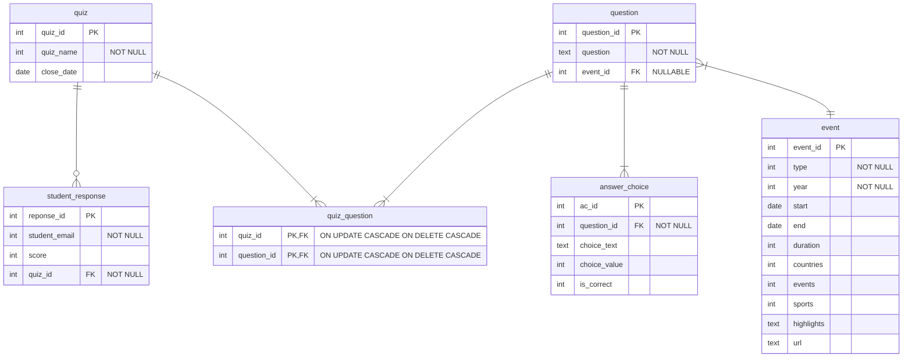

# Using sqlite3 instead of SQLAlchemy

To continue using `sqlite3` without SQLAlchemy use the following references:

- [Python sqlite3 tutorial](https://docs.python.org/3/library/sqlite3.html#tutorial)
- [Flask flaskr tutorial database setup](https://flask.palletsprojects.com/en/stable/tutorial/database/#define-and-access-the-database)

## Create and initialise the database

1. Add a parameter that defines the location of the database to the `__init__.py` create_app() function, e.g.:

    ```python
    app.config.from_mapping(
            SECRET_KEY='dev',
            # Creates the database in the instance folder
            DATABASE=os.path.join(app.instance_path, 'paralympics.sqlite'),
        )
    ```

2. Add code to create the database

   Code to initialise the database has been copied and adapted from the flaskr documentation and added to
   `placeholder\db.py`.

   Flaskr defines the database from a `schema.sql` file and does not add any data. The paralympics version has the data
   as well as the schema and is in `data\paralympics.sql`.

   Move `db.py` from the `placeholder` directory to your paralympics flask app package (folder).

3. Initialise the database file

   Run the command in the terminal to initialise the database: `flask --app student.flask_paralympics init-db`

   If successful, an instance folder should be created that contains a database file named `paralympics.sqlite`

4. Run the app using `flask --app student.flask_paralympics run --debug`

## Interaction with the database in routes

In most cases you are likely to interact with the database in a route.

Import the `get_db` function from the `db.py` module. Use this in each route that requires a database interaction.

For example, add this route that lists all the paralympic events.

```python
from flask import Blueprint

from student.flask_paralympics.db import get_db

main = Blueprint('main', __name__)


@main.route('/events')
def get_events():
    db = get_db()
    events = db.execute('SELECT * FROM Event').fetchall()
    events_text = [f'{event["year"]} {event["type"]} {event["start"]} {event["end"]}' for event in events]
    return events_text
```

Run the app and go to <http://127.0.0.1:5000/events>

### Try it yourself

Add a variable route that prints the details for one event using the event_id as parameter.
See ["variable rules"](https://flask.palletsprojects.com/en/stable/quickstart/#variable-rules)

## INSERT, UPDATE and DELETE

Next week the activities will add Jinja templates and forms for handling data input and presentation.

For now, routes will take values using variable routes and will return text to the view to render as HTML. Some will
have values fixed in the routes.

## INSERT

This activity inserts quiz data.

As a reminder the relevant database tables are:



The route code might look like this:

```python
import sqlite3


@main.route('/add-quiz-data')
def add_sample_quiz_data():
    db = get_db()
    try:
        # Insert the data, uses hard coded values for now
        quiz = db.execute('INSERT INTO quiz (quiz_name) VALUES (?)', ('Sample Quiz',))
        question = db.execute('INSERT INTO question (question) VALUES (?)',
                              ('What year were the paralympics first held in Barcelona?',))
        db.execute('INSERT INTO quiz_question (quiz_id, question_id) VALUES (?, ?)',
                   (quiz.lastrowid, question.lastrowid))
        db.execute('INSERT INTO answer_choice (question_id, choice_text, choice_value, is_correct) VALUES (?, ?, ?, ?)',
                   (question.lastrowid, '1992', 5, 1))
        # Commit the changes made above
        db.commit()
        return 'Sample data added to the database.'
    except sqlite3.Error as e:
        return 'Database error: ' + str(e)
```

### Try it yourself

Add a route to save a student response to the quiz.

## UPDATE

Add a variable route that takes parameters for quiz_id and close_date, e.g.

```python
@main.route('/update-quiz/<quiz_id>/<close_date>')
def update_quiz(quiz_id, close_date):
    db = get_db()
    try:
        db.execute('UPDATE quiz SET close_date = ? WHERE quiz_id = ?', (close_date, quiz_id))
        db.commit()
        return 'Quiz updated in the database.'
    except sqlite3.Error as e:
        return 'Database error: ' + str(e)
```

Run the app and try to add the close date 12/12/2024 for the quiz with id 1. Note that "/" has a specific meaning in URL
formatting so you need to be able to tell the URL that this is instead part of a string. To do that you replace the "/" 
character UTF8 encoding for the character, in this case `%2F`. So `12/12/2024` becomes `12%2F12%2F2024`. Or use a 
different format for the date such as `12-12-2024`.

### Try it yourself

Modify the question with id of 1 so that it is associated with the Barcelona event.

- Find the event_id of the Barcelona event. (Remember to join event to event_host to host to find the host.host == 'Barcelona')
- Update the event_id attribute of the question.
- Commit the change

## DELETE
Add a route to delete the student response using the id, e.g.

```python
@main.route('/delete-response/<response_id>')
def delete_response(response_id):
    """Delete a student response from the database."""
    db = get_db()
    try:
        db.execute('DELETE FROM student_response WHERE response_id = ?', (response_id,))
        db.commit()
        return 'Student response deleted from the database.'
    except sqlite3.Error as e:
        return 'Database error: ' + str(e)
```

### Try it yourself

Delete the quiz saved earlier.

Review the `ON DELETE` constraints in the database schema. If you delete the quiz, what happens?